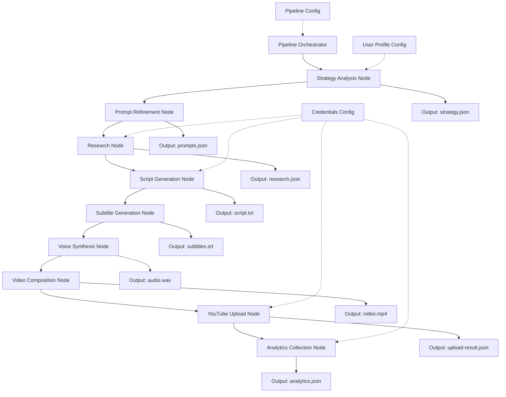

# Design Document

## Overview

動画自動生成システムは、Node.jsベースのパイプライン実行エンジンとして実装します。9つの独立したノードが順次実行され、各ノードは前のノードの出力を入力として受け取ります。システムは定期実行（cronやタスクスケジューラー）を想定し、設定ファイルの変更だけで動作をカスタマイズできる設計とします。

### Key Design Principles

1. **Single Responsibility**: 各ノードは1つの明確な責任を持つ
2. **Fail-Fast**: エラー発生時は即座にパイプラインを停止し、詳細なログを残す
3. **Configuration-Driven**: コード変更なしで設定ファイルだけで動作を制御
4. **Idempotency**: 同じ入力に対して同じ出力を生成（可能な限り）
5. **Observability**: すべての処理をログに記録し、デバッグを容易にする

## Architecture

### System Architecture Diagram



### Technology Stack

- **Runtime**: Node.js (v18+)
- **Language**: TypeScript
- **CLI Execution**: child_process (spawn/exec)
- **Configuration**: JSON files (stored in `config/` directory)
- **Logging**: Winston or Pino
- **File System**: fs/promises
- **YouTube API**: googleapis npm package
- **Scheduling**: External (cron, Windows Task Scheduler, etc.)
- **Type Definitions**: Centralized in `src/types/` directory

## Node Detailed Designs

各ノードの詳細設計は個別ファイルに記載されています：

1. [Strategy Analysis Node](./nodes/01-strategy-analysis.md) - ユーザープロファイル統合と戦略策定
2. [Prompt Refinement Node](./nodes/02-prompt-refinement.md) - プロンプト最適化
3. [Research Node](./nodes/03-research.md) - Codex CLIを使用したリサーチ
4. [Script Generation Node](./nodes/04-script-generation.md) - Claude CLIを使用した原稿生成
5. [Subtitle Generation Node](./nodes/05-subtitle-generation.md) - SRT字幕生成
6. [Voice Synthesis Node](./nodes/06-voice-synthesis.md) - VOICEVOX音声合成
7. [Video Composition Node](./nodes/07-video-composition.md) - FFmpeg動画合成
8. [YouTube Upload Node](./nodes/08-youtube-upload.md) - YouTube投稿
9. [Analytics Collection Node](./nodes/09-analytics-collection.md) - アナリティクス収集

## Core Interfaces

### Base Node Interface

すべてのノードが実装する共通インターフェース。

```typescript
interface Node {
  name: string;
  execute(input: NodeInput): Promise<NodeOutput>;
  validate(input: NodeInput): ValidationResult;
  getConfig(): NodeConfig;
}

interface NodeInput {
  previousOutput?: any;
  config: NodeConfig;
  workDir: string;
}

interface NodeOutput {
  success: boolean;
  data: any;
  outputPath: string;
  metadata: {
    executionTime: number;
    timestamp: string;
  };
}

interface NodeConfig {
  enabled: boolean;
  timeout: number; // milliseconds
  retryCount: number;
  retryDelay: number; // milliseconds
  [key: string]: any; // node-specific config
}
```

### Pipeline Orchestrator

```typescript
interface PipelineOrchestrator {
  loadConfig(configPath: string): Promise<PipelineConfig>;
  validateConfig(config: PipelineConfig): ValidationResult;
  execute(): Promise<PipelineResult>;
  handleNodeError(node: string, error: Error): void;
}

interface PipelineConfig {
  outputDir: string;
  logLevel: 'DEBUG' | 'INFO' | 'WARN' | 'ERROR';
  nodes: NodeConfig[];
  userProfilePath: string;
  credentialsPath: string;
}

interface PipelineResult {
  success: boolean;
  completedNodes: string[];
  failedNode?: string;
  error?: Error;
  outputs: Record<string, string>; // node name -> output file path
}
```

## Data Models

### File System Structure

```
project-root/
├── config/
│   ├── pipeline-config.json
│   ├── user-profile.json
│   └── credentials.json
├── src/
│   ├── orchestrator/
│   │   └── pipeline.ts
│   ├── nodes/
│   │   ├── base-node.ts
│   │   ├── strategy-analysis.ts
│   │   ├── prompt-refinement.ts
│   │   ├── research.ts
│   │   ├── script-generation.ts
│   │   ├── subtitle-generation.ts
│   │   ├── voice-synthesis.ts
│   │   ├── video-composition.ts
│   │   ├── youtube-upload.ts
│   │   └── analytics-collection.ts
│   ├── utils/
│   │   ├── logger.ts
│   │   ├── cli-executor.ts
│   │   └── validator.ts
│   └── index.ts
├── output/
│   └── [timestamp]/
│       ├── strategy.json
│       ├── prompts.json
│       ├── research.json
│       ├── script.txt
│       ├── subtitles.srt
│       ├── audio.wav
│       ├── video.mp4
│       ├── upload-result.json
│       └── analytics.json
├── logs/
│   └── pipeline-[timestamp].log
└── package.json
```

### Configuration Files

**config/pipeline-config.json:**
```json
{
  "outputDir": "output",
  "logLevel": "INFO",
  "userProfilePath": "config/user-profile.json",
  "credentialsPath": "config/credentials.json",
  "nodes": {
    "strategyAnalysis": {
      "enabled": true,
      "timeout": 300000,
      "retryCount": 0
    },
    "promptRefinement": {
      "enabled": true,
      "timeout": 120000,
      "retryCount": 0
    },
    "research": {
      "enabled": true,
      "timeout": 600000,
      "retryCount": 3,
      "retryDelay": 5000,
      "codexCommand": "codex",
      "codexArgs": ["--search"]
    },
    "scriptGeneration": {
      "enabled": true,
      "timeout": 300000,
      "retryCount": 3,
      "retryDelay": 5000,
      "claudeCommand": "claude",
      "minLength": 400,
      "maxLength": 3000,
      "note": "For AI news: 400-600 chars, For tutorials: 1500-2500 chars"
    },
    "subtitleGeneration": {
      "enabled": true,
      "timeout": 60000,
      "retryCount": 0,
      "format": "srt",
      "maxCharsPerLine": 42,
      "maxLines": 2
    },
    "voiceSynthesis": {
      "enabled": true,
      "timeout": 300000,
      "retryCount": 0,
      "voicevoxHost": "http://localhost:50021",
      "speaker": 1,
      "speed": 1.0,
      "pitch": 0.0,
      "intonation": 1.0
    },
    "videoComposition": {
      "enabled": true,
      "timeout": 600000,
      "retryCount": 0,
      "ffmpegCommand": "ffmpeg",
      "resolution": "1280x720",
      "fps": 30,
      "codec": "libx264",
      "backgroundImage": "assets/background.jpg"
    },
    "youtubeUpload": {
      "enabled": true,
      "timeout": 600000,
      "retryCount": 2,
      "retryDelay": 10000,
      "privacyStatus": "unlisted",
      "category": "22"
    },
    "analyticsCollection": {
      "enabled": true,
      "timeout": 180000,
      "retryCount": 2,
      "retryDelay": 5000,
      "dateRange": "last7days"
    }
  }
}
```

**config/user-profile.json:**
```json
{
  "tone": "enthusiastic",
  "values": [
    "innovation",
    "accessibility",
    "practical knowledge"
  ],
  "prohibitedWords": [
    "絶対",
    "必ず",
    "100%"
  ],
  "targetAudience": "tech-savvy professionals aged 25-40",
  "contentPreferences": {
    "topics": [
      "AI",
      "web development",
      "productivity tools"
    ],
    "avoidTopics": [
      "politics",
      "controversial social issues"
    ],
    "preferredLength": "medium"
  }
}
```

## Error Handling

### Error Handling Strategy

1. **Node-Level Errors:**
   - 各ノードは独自のエラーをキャッチし、NodeOutputのsuccessフラグで報告
   - リトライ可能なエラー（ネットワーク、一時的なCLI失敗）は自動リトライ
   - リトライ不可能なエラー（設定エラー、ファイル不足）は即座に失敗

2. **Pipeline-Level Errors:**
   - ノードが失敗した場合、パイプラインは即座に停止
   - エラー詳細をログに記録
   - 失敗したノード名と理由を含む通知を生成

3. **Configuration Errors:**
   - パイプライン開始前に設定を検証
   - 必須フィールドの欠落、無効な値を検出
   - 検証失敗時は詳細なエラーメッセージを表示して終了

### Error Types

These types should be defined in `src/types/error-types.ts`:

```typescript
enum ErrorType {
  CONFIG_ERROR = 'CONFIG_ERROR',
  CLI_EXECUTION_ERROR = 'CLI_EXECUTION_ERROR',
  FILE_NOT_FOUND = 'FILE_NOT_FOUND',
  TIMEOUT_ERROR = 'TIMEOUT_ERROR',
  VALIDATION_ERROR = 'VALIDATION_ERROR',
  API_ERROR = 'API_ERROR',
  NETWORK_ERROR = 'NETWORK_ERROR'
}

class PipelineError extends Error {
  constructor(
    public type: ErrorType,
    public node: string,
    message: string,
    public originalError?: Error
  ) {
    super(message);
  }
}
```

### Retry Logic

```typescript
async function retryWithBackoff<T>(
  fn: () => Promise<T>,
  maxRetries: number,
  baseDelay: number
): Promise<T> {
  for (let attempt = 0; attempt <= maxRetries; attempt++) {
    try {
      return await fn();
    } catch (error) {
      if (attempt === maxRetries) throw error;
      
      const delay = baseDelay * Math.pow(2, attempt);
      await sleep(delay);
    }
  }
  throw new Error('Retry failed');
}
```

## Testing Strategy

### Unit Testing

各ノードとユーティリティ関数の単体テスト。

**Test Coverage:**
- 各ノードのexecuteメソッド（正常系・異常系）
- 設定の検証ロジック
- CLI実行ラッパー
- データ変換関数（字幕生成、プロンプト生成など）

**Testing Framework:**
- Jest or Vitest
- Mock: CLI実行、ファイルシステム、外部API

### Integration Testing

複数ノードの連携テスト。

**Test Scenarios:**
- 2つのノード間のデータ受け渡し
- エラー発生時のパイプライン停止
- リトライロジックの動作確認

### End-to-End Testing

パイプライン全体の実行テスト（実際のCLIツールを使用）。

**Test Approach:**
- テスト用の設定ファイルを使用
- モックデータで各ノードを実行
- 最終的な動画ファイルの生成を確認
- YouTube投稿は実際には行わず、dry-runモードで検証

## Performance Considerations

### Execution Time Budget

- Strategy Analysis: 5分
- Prompt Refinement: 2分
- Research: 10分
- Script Generation: 5分
- Subtitle Generation: 1分
- Voice Synthesis: 5分
- Video Composition: 10分
- YouTube Upload: 10分（動画サイズによる）
- Analytics Collection: 3分

**Total: 約51分**

### Optimization Strategies

1. **Parallel Processing (Future Enhancement):**
   - 独立したノード（例：字幕生成と音声合成）を並列実行
   - 現在は順次実行だが、将来的に並列化を検討

2. **Caching:**
   - リサーチ結果のキャッシュ（同じクエリの再利用）
   - 戦略データのキャッシュ（短期間での再実行時）

3. **Resource Management:**
   - FFmpegのスレッド数制限
   - VOICEVOXのバッチ処理

## Security Considerations

### Credential Management

- API認証情報は環境変数または暗号化された設定ファイルに保存
- credentials.jsonはgitignoreに追加
- OAuth 2.0トークンの安全な保存と更新

### Input Validation

- すべての設定値を検証
- CLIコマンドのインジェクション攻撃を防ぐ
- ファイルパスのサニタイズ

### API Rate Limiting

- YouTube APIのクォータ制限を考慮
- リクエスト間隔の調整
- エラー時のバックオフ

## Deployment and Operations

### Deployment

1. Node.js環境のセットアップ
2. 依存パッケージのインストール（npm install）
3. 外部ツールのインストール：
   - Codex CLI
   - Claude CLI
   - VOICEVOX
   - FFmpeg
4. 設定ファイルの作成
5. 認証情報の設定

### Scheduled Execution

**Linux/Mac (cron):**
```bash
0 9 * * * cd /path/to/project && node dist/index.js >> logs/cron.log 2>&1
```

**Windows (Task Scheduler):**
- タスクスケジューラーでNode.jsスクリプトを定期実行
- ログファイルへのリダイレクト設定

### Monitoring

- ログファイルの定期確認
- エラー通知（メール、Slack、Discord等）
- 実行時間のトラッキング
- 成功率のモニタリング

### Maintenance

- ログファイルのローテーション
- 古い出力ファイルの削除
- API認証トークンの更新
- 依存パッケージのアップデート
