# ワークフロー設計

## 全体ワークフロー

### 標準実行フロー（全ノード）

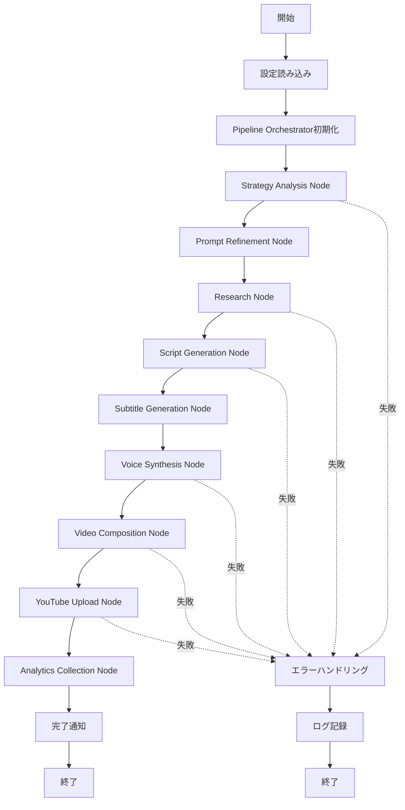

### MVP実行フロー（Node 03-08）

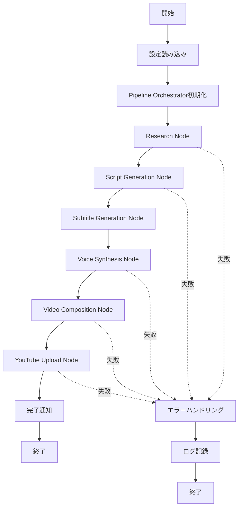

## ノード別ワークフロー

### 03 Research Node

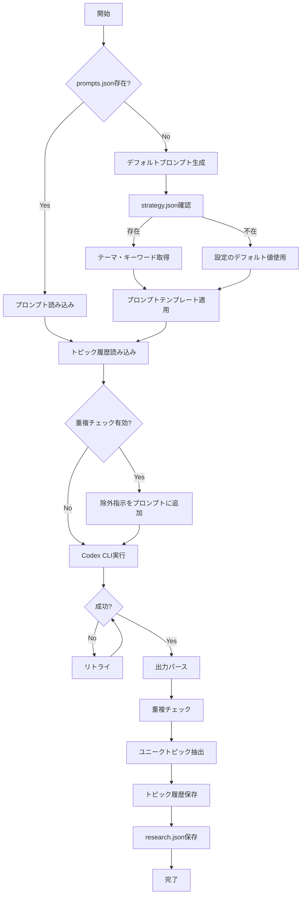

### 04 Script Generation Node

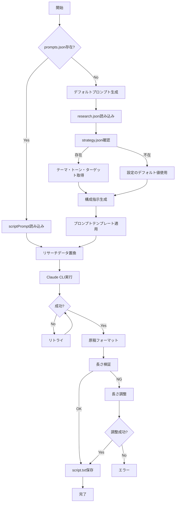

### 05 Subtitle Generation Node

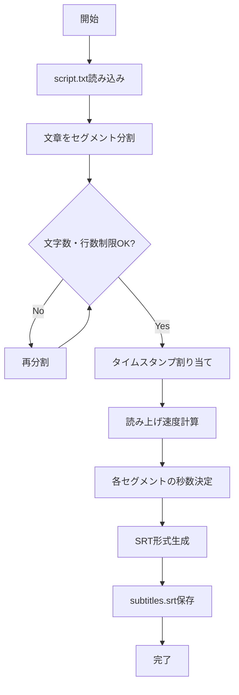

### 06 Voice Synthesis Node

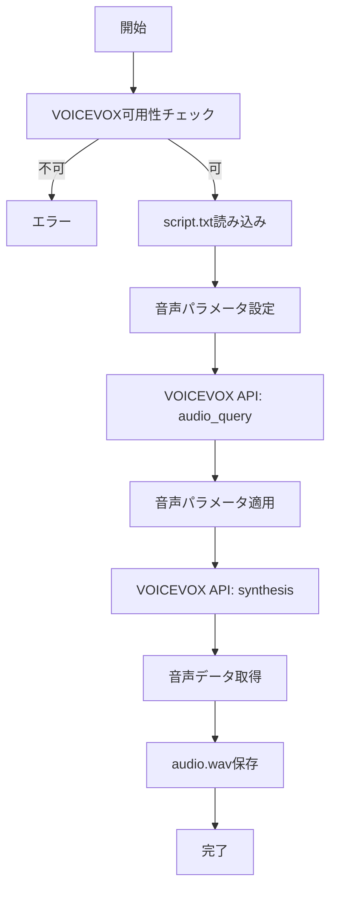

### 07 Video Composition Node

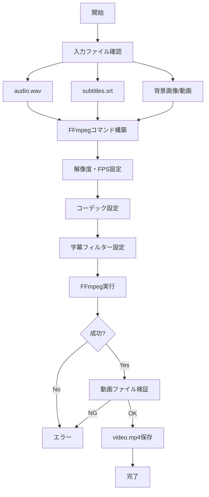

### 08 YouTube Upload Node

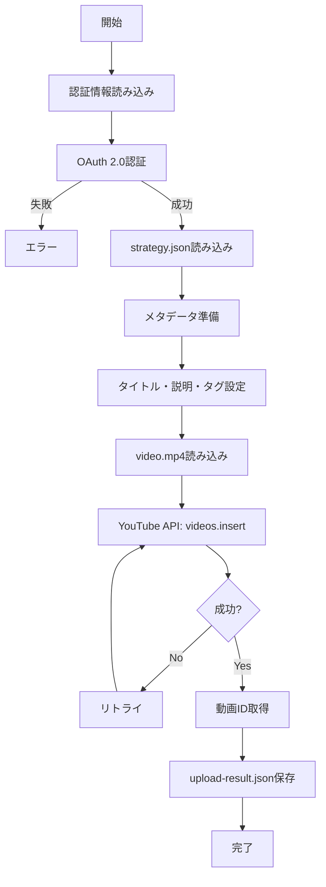

## エラーハンドリングフロー

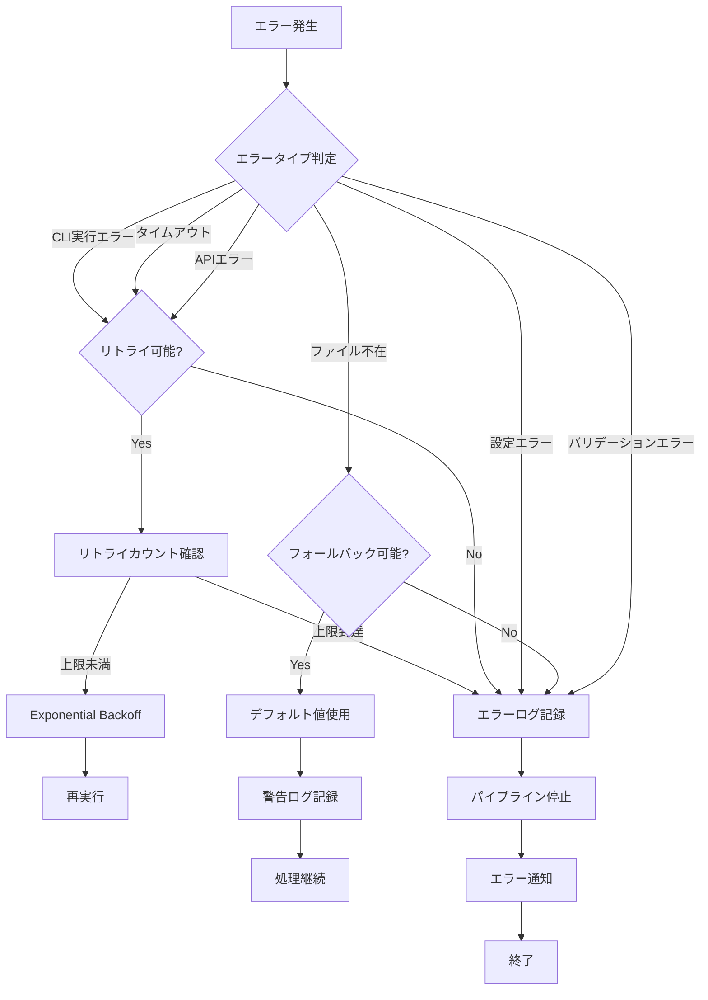

## 日次実行ワークフロー（AIニュース）

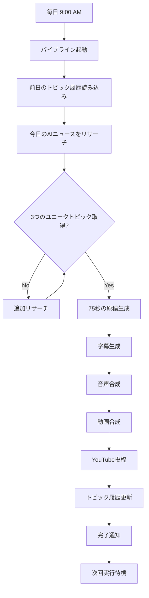

## データフロー詳細

### ファイル間データフロー

```
strategy.json
  ├─→ prompts.json (metadata)
  └─→ script.txt (theme, tone)
  
research.json
  └─→ script.txt (content)
  
script.txt
  ├─→ subtitles.srt (text + timing)
  └─→ audio.wav (text → speech)
  
subtitles.srt + audio.wav
  └─→ video.mp4 (composition)
  
video.mp4 + strategy.json
  └─→ upload-result.json (YouTube)
  
upload-result.json
  └─→ analytics.json (metrics)
```

### キャッシュ・履歴フロー

```
strategy.json
  └─→ cache/strategy.json (再利用用)
  
research.json
  └─→ cache/topic-history.json (重複チェック用)
  
upload-result.json
  └─→ cache/video-history.json (アナリティクス追跡用)
```

## 並列実行の可能性（将来拡張）

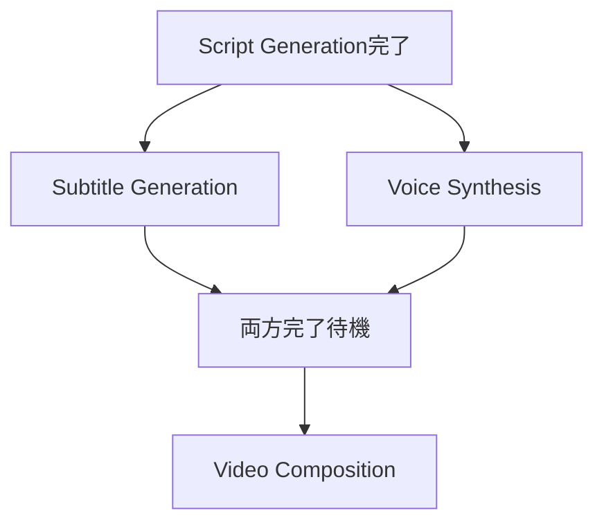

## ロールバック戦略

### ノード失敗時の対応

1. **Research Node失敗**
   - 前日のリサーチ結果を使用
   - プレースホルダーデータで継続

2. **Script Generation失敗**
   - テンプレート原稿を使用
   - 手動介入を要求

3. **Voice Synthesis失敗**
   - 前回の音声を再利用
   - TTS代替サービスを使用

4. **YouTube Upload失敗**
   - ローカルに保存
   - 次回実行時に再試行

## 監視ポイント

### 各ノードの監視項目

| ノード | 監視項目 | 閾値 |
|--------|---------|------|
| Research | 実行時間 | 10分以内 |
| Research | トピック数 | 3個以上 |
| Script | 文字数 | 400-600文字 |
| Script | 実行時間 | 5分以内 |
| Voice | 音声ファイルサイズ | 1MB以上 |
| Video | 動画ファイルサイズ | 5MB以上 |
| Video | 解像度 | 1280x720以上 |
| Upload | アップロード成功率 | 95%以上 |

## トラブルシューティングフロー

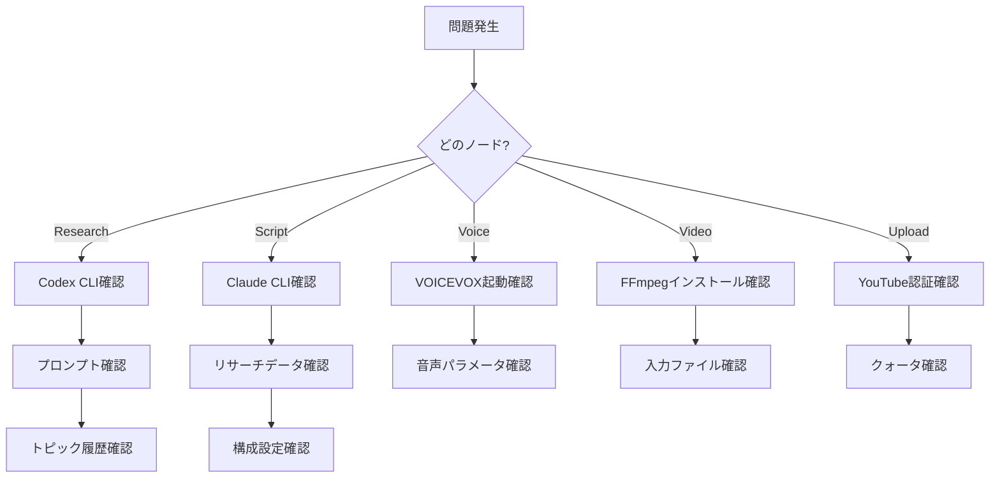
